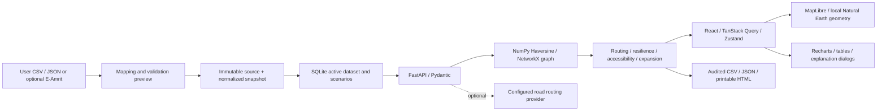

# EV Network Intelligence — India

A minimal regional station finder with an optional academic analysis workspace, built with React + FastAPI. Observed source fields, graph calculations and user-configured estimates have distinct labels. No dataset is loaded automatically, and no demo stations are substituted when a source fails.


## Everyday use

The default screen has only **Find stations** and **Plan a trip**. Search by city or station, select a state, and choose a card or map pin. Station cards offer **Start here**, **Go here** and **Navigate to station**. Trip endpoints can be any address, coordinates, current location, map point or loaded station. Select a source-backed EV edition or custom profile before battery-aware consumer trips; current charge, reserve and adjustable driving assumptions personalise the result. Station browsing stays open without a vehicle. The default local map groups nearby source records into counted pins and shows local state outlines. Configuring Google Maps replaces the finder basemap and enables Google Places and Routes. Advanced KPIs, graph controls, scores and audits live behind **Project tools → Open academic analysis**.

The application is restricted to **Uttar Pradesh, Delhi, Rajasthan, Haryana, Punjab and Madhya Pradesh**. This restriction is enforced in the backend dataset response, graphs, routes, comparisons, reports and exports. Original imported snapshots are preserved. State aliases such as UP, MP and NCT of Delhi are recognized; absent state values are not inferred from coordinates.

The active user-supplied `archive.zip` contains **282 usable regional records**: UP 65, Delhi 102, Rajasthan 42, Haryana 49, Punjab 16 and Madhya Pradesh 8. From 1,547 raw rows, 14 fail coordinate validation and 202 repeated valid rows are removed, leaving 1,331 source records. Of the 350 rows labeled with the selected states, 68 have coordinates clearly outside the regional map and are flagged and excluded. The remaining 981 records have other or ambiguous state labels. The original source and previous snapshot are preserved. Consumer trips use a configured road provider with labeled geographic fallback; charging availability remains unverified.

State labels and coordinates in this dataset are sometimes inconsistent. A regional plausibility check uses the local Natural Earth polygons plus a disclosed 5 km border tolerance; it never repairs GPS or infers a missing state. These cartographic outlines are not official boundaries. `Delhi NCR` is ambiguous across multiple states and is not silently treated as Delhi. The `Harayana` spelling is normalized to Haryana, and case/whitespace aliases are handled.

## Run locally

Use Python 3.11–3.13 and Node 22.12+ or 24. Validation used Python 3.13 and Node 24.11.1. Run commands from this project directory.

```sh
python3 -m venv .venv
source .venv/bin/activate
python -m pip install -r backend/requirements.lock.txt
python -m uvicorn backend.main:app --host 127.0.0.1 --port 8001
```

In a second terminal:

```sh
cd frontend
npm ci
npm run dev
```

Open **http://127.0.0.1:5173**. Backend API documentation is at **http://127.0.0.1:8001/docs**. Port 8001 deliberately avoids an existing local service on port 8000. The Vite dev and preview proxies both target 8001. To change it, update both proxies and the backend launch command.

For the production bundle, keep the backend running and use:

```sh
cd frontend
npm run build
npm run preview
```

Open **http://127.0.0.1:4173**. This is a local preview, not a deployment. On Windows activate the virtual environment with `.venv\Scripts\activate`.

## Google Maps and navigation

Copy `.env.example` to the ignored root `.env` if it does not exist. In your Google Cloud project, enable billing and **Maps JavaScript API**, **Places API (New)** and **Routes API**. Create separate keys as described in [Google's security guidance](https://developers.google.com/maps/api-security-best-practices):

- `GOOGLE_MAPS_BROWSER_KEY`: allow Maps JavaScript API and restrict it to your website origins. Local origins are `http://127.0.0.1:5173` and `http://localhost:5173`; add port 4173 equivalents for preview. This restricted key is intentionally delivered to the browser by `/api/maps/config`.
- `GOOGLE_MAPS_API_KEY`: allow Places API (New) and Routes API. Keep it on the backend; use the server's public outbound IP for an IP restriction. A website-restricted key cannot authenticate these server requests.
- `GOOGLE_MAPS_MAP_ID`: `DEMO_MAP_ID` works for local testing; use your own JavaScript map ID for production.

Restart the backend and reload the page after changing keys. The finder uses Google's map with advanced markers when the browser key is present; Places and Routes are selected when both keys are present. Authentication still depends on enabled APIs, billing, restrictions and quota. Missing keys retain the existing local map and public providers. A configured Google service failure displays an error; it does not fabricate a successful Google response. Google content is displayed on Google's map and is not cached or saved to snapshots/scenarios. Academic graph tools retain MapLibre and OSRM.

**Start navigation** opens a [Google Maps directions URL](https://developers.google.com/maps/documentation/urls/get-started), which requires no API key. Arbitrary entered start/end coordinates are preserved. A current-location start lets Google obtain a fresh device position. Each planned charging waypoint has its own leg link, avoiding mobile waypoint limits. Subsequent legs start from current location. Google may recalculate the path; its navigation path is not a guaranteed reproduction of the battery model. Mobile devices may launch turn-by-turn guidance; desktop opens directions. Charger availability remains unverified.

Google Maps, Places API (New) and Routes API were live-verified on 2026-10-07 using public landmarks. The finder displays real Google tiles, advanced station markers, counted clusters, address suggestions and road geometry; the complete trip endpoint returned HTTP 200 with a feasible battery model. The older key blocked target APIs; the new user-supplied key works for all three services. Local configuration currently uses that working key in both fields. Replace the browser value with a separate website-restricted key before deployment; a website-restricted key cannot authenticate server REST requests. No real keys are stored in documentation or source. Before public deployment, supply application terms and privacy notices meeting Google's [Routes policies](https://developers.google.com/maps/documentation/routes/policies) and [Places policies](https://developers.google.com/maps/documentation/places/web-service/policies).

## Data onboarding and provenance

1. Upload an actual CSV/JSON file, or attempt the optional E-Amrit refresh.
2. Enter its source name and URL; inspect the raw preview and column mapping.
3. Review accepted records, rejections, duplicate IDs and missing fields before committing the import.
4. An immutable snapshot stores normalized records, original source bytes, SHA-256, mapping and import time. The active snapshot and named scenarios use SQLite.

Required for an accepted record: source ID, source name, numeric latitude/longitude in the stated India envelope. Other standardized fields stay null when absent. IDs are never invented; duplicate IDs retain the first valid record with an audit entry. Explicit non-Indian country values are rejected. Coordinate validation is range/envelope validation, **not ground verification or an official boundary check**.

CSV columns and JSON keys can be mapped to:

`station_id, station_name, latitude, longitude, city, state, country, operator, status, availability, connector_type, num_chargers, charging_power_kw`

The schema download contains headers only. JSON accepts an array, or an object containing a `data`/`stations` array. File limit: 15 MB; import limit: 2,000 records. Preview tokens expire after 30 minutes. No file is silently truncated into a smaller production dataset.

### Current user-supplied dataset

The active source is `ev-charging-stations-india.csv` from the user-provided `archive.zip`. No publisher URL, collection date or live freshness was supplied; no affiliation with E-Amrit or Tata is asserted. The original CSV is copied without changes to `data/raw/ev-charging-stations-india.csv`. Address fields are preserved and searchable. The numeric `type` codes are stored as `source_type`, without inferring connectors, power, ports or availability.

The file has no station ID column. Opt-in import creates deterministic internal record keys from SHA-256 of each source row, clearly marked as derived rather than publisher identifiers. Identical source rows collapse; differently named AC/DC rows at the same coordinate remain distinct records. Missing source-ID handling stays strict by default for other imports; enable the labeled internal-ID checkbox before importing this CSV.

- Active snapshot: `2ee144cf5153486e90e9cd0ba969a857`.
- Imported UTC: `2026-10-04T08:59:31.325637+00:00`.
- Raw SHA-256: `c6a8f921195877a474c47c7a524e117bc72e18f6ba4f39a4f73865bcd1092f20`.
- Full audit including all rejected, duplicate and geographic-conflict rows: `docs/verification/user-dataset-import.json`.

Reproduce the reviewed import locally:

```sh
python3 -m scripts.import_user_archive /path/to/archive.zip
python3 -m scripts.import_user_archive /path/to/archive.zip --activate
python3 -m scripts.verify_loaded_dataset
```

Optional Gemini trip explanations are implemented on the backend. Put the exact copied key in the ignored root `.env` as `GEMINI_API_KEY`, select `GEMINI_MODEL=gemini-2.5-flash`, then restart the backend. The Explain button sends calculated trip numbers only; addresses, station names and precise coordinates are excluded. AI text is labeled and does not calculate routes or invent availability. The initial supplied key returned HTTP 401; a corrected local key and successful live authentication are still pending. Configuration does not mean a verified connection. [Google key setup](https://ai.google.dev/gemini-api/docs/api-key) and [2.5 Flash access requirements](https://ai.google.dev/gemini-api/docs/models/gemini-2.5-flash) apply; Google currently restricts this model to eligible existing accounts. No key is included in the frontend or committed files.

### Historical first acceptance dataset

The existing project supplied `data/raw/eamrit_india_charging_stations.json`, previously documented as a public [E-Amrit / NITI Aayog](https://e-amrit.niti.gov.in/charging-station-locators) extract retrieved on **2026-09-10**. That provenance comes from the preserved original README in `legacy/`; it was not independently re-downloaded during this implementation. The endpoint [getChargingStation](https://e-amrit.niti.gov.in/getChargingStation) timed out during the current check. The unchanged source file was explicitly uploaded through the new import UI, reviewed and loaded on 2026-10-04.

| Audit field | Value |
|---|---|
| Raw records | 160 |
| Validated records | 158 |
| Rejected records | 2 |
| Duplicate IDs removed | 0 |
| Snapshot ID | `57185fa1583f4b7e836e0999d1e22862` |
| Imported UTC | `2026-10-04T07:29:47.448160+00:00` |
| Raw SHA-256 | `52093ecc09ef20645bfbf9ad527820cbb880fa53bd490e874f88028cd15257af` |

Source row 93 has invalid coordinates; row 148 has no station name. Country, operator, status, connector type, port count and power are absent in all 158 accepted records. The app preserves those nulls and disables dependent analyses. All accepted source availability values are code `1`: **source-recorded codes are not live occupancy or uptime**. Source `type` is not assumed to mean connector type. Repeated names and co-located distinct IDs remain distinct records. This extract is not a census of Indian charging infrastructure.

The local active snapshot is excluded from Git. A fresh checkout starts at onboarding. To recreate this historical dataset, explicitly upload the file above and use the documented source attribution. A new import creates a new snapshot ID. Save a scenario before unloading if you want to restore an earlier snapshot through the UI. Local persistence is not intended as a multi-user database.

## Architecture



`backend/ingestion.py` standardizes data; `store.py` manages snapshots/scenarios; `engine.py` contains algorithms; `models.py` validates inputs; `main.py` exposes the API. The frontend separates onboarding from a lazily loaded console. MapLibre uses an explicit locally bundled worker. Fonts and the Natural Earth basemap are local assets; no tile API key is required. The original Streamlit prototype is preserved under `legacy/` and is not imported by the new application.

## Workspaces and advanced features

| Workspace | Implemented behavior |
|---|---|
| Trip Planner | Loaded-name/city/state search; explicit manual coordinates; nearest-station snapping; Dijkstra/A*; actual runtime; no-path result; risk; battery feasibility and SOC timeline |
| Infrastructure | Real coordinate map; source availability/status colors where available; state/city distributions; quality audit; inspector and route/removal actions; 2–4 station comparison; field completeness; DBSCAN |
| Network Graph | Radius/k-NN controls; weighted edges; node/edge selectors; components; degree, weighted degree, centralities, PageRank, density, adjacency; articulation/bridge highlights; health formula |
| Resilience | Selected station removed in a graph copy; before/after topology and paths; reference-station reachability; disconnected station IDs |
| Accessibility | Relative index; available-only weight controls; 100% validation; configurable radius; map/ranking; per-record weight coverage |
| Expansion | Gap explorer, source density heatmap, geographic MST candidate pool, top 10 ranking, rationale/inputs, actual graph-addition comparison |
| Methodology | Algorithms and limitations; Viva mode; source capability matrix; reproducibility audit; report generator |

Scenarios save filters, graph settings, vehicle assumptions, selected endpoints, modeled outage, accessibility weights and the original snapshot ID. Load reactivates that immutable snapshot; duplicate, delete, reset and JSON export are available. Deleting a scenario does not delete source snapshots. Browser refresh preserves settings, while calculated outputs are recomputed to prevent stale results. Search/filter changes invalidate results tied to earlier inputs.

CSV/JSON exports cover filtered stations, quality audits, routes, timeline/legs, comparisons, graph analyses, outages, accessibility and candidates. JSON carries an audit envelope; each CSV row carries `_analysis_audit`. Exports include snapshot ID, raw hash, source, import time, filters, graph settings, relevant assumptions and algorithm versions. CSV values are quoted and protected against spreadsheet formula injection. Reports are escaped HTML with a print/save-as-PDF control and labeled observed/calculated/modeled sections. A generated acceptance report is in `docs/verification/academic-report.html`.

## Algorithms and viva explanations

**Graph:** `G=(V,E)` is an undirected weighted geographic model. Nodes are accepted source records. Radius edges join pairs whose Haversine distance is at most the entered threshold. k-NN takes the undirected union of each node's nearest-neighbor choices, with deterministic tie-breaking. Neither method adds fallback edges or forces connectivity. Every edge stores distance, estimated travel time and route cost; route cost currently equals distance.

**Haversine:** `d = 2R asin(sqrt(sin²(Δφ/2) + cos φ1 cos φ2 sin²(Δλ/2)))`, with radians and `R=6371.0088 km`. Estimated minutes are `distance / entered speed × 60`.

**Routing:** Dijkstra minimizes accumulated geographic distance. A* adds direct Haversine distance to the target, an admissible lower bound for these weights. Runtime is measured with `perf_counter` around routing, not invented. Manual points snap to real filtered stations; entered-point connector distances are included in route/battery totals. No path is a legitimate result.

**Academic numerical battery model:** energy used per leg is `distance × consumption / 100`. Reserve energy is `capacity × reserveSOC / 100`. If needed before a leg, a modeled stop adds energy up to the target SOC, subject to maximum stops. Grid energy is `battery energy added / efficiency`; charging minutes are `grid energy / entered power × 60`. Sequential SOC and infeasibility reasons are exposed. The algorithm evaluates the selected shortest path; it does not optimize an alternative battery-constrained path.

**Centrality:** degree counts incident edges; weighted degree sums distances. Betweenness measures shortest-path mediation, closeness reflects weighted reachability, and PageRank uses affinity `1/(1+distance)`. Co-located records retain zero distance for routing; a disclosed `10^-9 km` epsilon makes weighted centrality calculations positive. Components, bridges and articulation points use exact NetworkX algorithms. Route risk is High if it crosses a bridge; Moderate if it includes an articulation or a leg over 50 km; otherwise Low. It describes topology, not driving safety.

**Network health:** `40L + 10D + 20I + 20R + 10P`, where `L` is largest-component fraction, `D` raw density, `I=1-isolated/n`, `R=1-(articulation/n + bridges/m)/2`, and `P=max(0,1-averageNearest/100km)`. Zero denominators use 1; empty graphs have no score. This is a disclosed heuristic, not an official rating.

**Accessibility:** `100 × Σ(wᵢ xᵢ) / Σ(available wᵢ)`. Inputs: inverse normalized nearest distance, normalized nearby count and degree, usable source binary availability, and ports/power only if observed. Missing values are excluded per record and effective weight coverage is shown. Classes: Excellent ≥80, Good ≥60, Moderate ≥40, Poor ≥20, Very Poor <20. The index is relative to filtered station records; it does not measure population accessibility or demand.

**Resilience:** remove only a copied graph node. Compare exact components, density, bridge/articulation counts and all-pairs average distance within components. Reachability compares surviving nodes from the disclosed reference, excluding the removed station from the baseline count. A shorter average after removal can reflect lost paths; it is not necessarily an improvement.

**Expansion:** build a separate complete geographic graph and its MST to identify gaps; consider spherical midpoints of the 40 longest positive MST edges and rank up to 10. Weights: normalized nearest gap 35%, nearby scarcity 25%, component joining 25%, geometric pair-gap halving 15%. Addition rebuilds the selected graph, including changed k-NN neighbors. Candidate points remain explicitly modeled and are never inserted into the observed dataset. A candidate can remain isolated and increase component count; no beneficial connectivity is fabricated.

**Clustering/completeness:** DBSCAN uses Haversine distance, user radius and minimum samples on accepted coordinates. Noise means outside qualifying geographic clusters, not lack of demand. Completeness counts eight source fields (latitude, longitude, city, state, status, connector, ports, power); it measures available metadata, not station reliability.

## Places, current location and road trips

The finder accepts an address/place, latitude and longitude, a map-selected point, current location, or a loaded station at either end. Search sends the entered query to Google Places when both Maps keys are configured, otherwise [Photon](https://github.com/komoot/photon); selecting current location explicitly requests browser permission and preserves device coordinates/accuracy. Denied or unavailable location falls back to manual entry. The India coordinate envelope is enforced; charging candidates still come only from the six-state source scope. User endpoints never become source station records.

`POST /api/trip` sends selected coordinates to Google Routes when both Maps keys are configured, otherwise [OSRM](https://project-osrm.org/docs/v5.24.0/api/), for actual road geometry, distance and estimated duration. Google routes use `TRAFFIC_UNAWARE`; neither adapter supplies live traffic. Battery consumption includes every provider road leg from the entered start through any modeled source-station stops to the entered destination. No charging is assumed at an arbitrary home/start. Stops are selected by a deterministic forward-progress heuristic within 5 km of the original road corridor, re-routed using actual station coordinates and checked against road-leg distances. This can fail battery feasibility and is not an optimal battery-constrained itinerary. Connector compatibility uses known specifications and otherwise remains unknown. Known incompatible stops are excluded; unknown stops are optional and make the plan conditional. Missing charger power, vehicle limits or tariffs produce unknown timing/cost, rather than invented values. Availability is unverified.

The public demo services were live-checked using India Gate → Heritage City (24.353 km, 27.343 minutes at the check time). They provide no traffic or production SLA. Configure `EV_GEOCODER_URL` and `EV_OSRM_URL` in the root `.env` for your own services; defaults are `https://photon.komoot.io` and `https://router.project-osrm.org`. Set either variable to an empty string to disable it. Photon/OSRM requests are bounded and cached in process for ten-minute buckets, without persisting private search queries or route coordinates. Google responses are not cached. Provider failure shows a labeled geographic fallback with entered-point connector distances included; the fallback may legitimately have no network path.

Academic `/api/route` retains Dijkstra/A* and geographic battery totals, with an optional separately labeled road overlay. The consumer finder uses road-based battery totals through `/api/trip`. Backend `.env` is loaded at startup and must be kept private. Copy `.env.example` to `.env` only if no local `.env` exists.

## Verification

```sh
python -m pytest -q
python -m ruff check backend scripts
python -m ruff format --check backend scripts
python -m scripts.verify_loaded_dataset
cd frontend
npm run lint
npm run format:check
npm test
npm run build
npm audit
```

The loaded-dataset verification script is specifically for the supplied documented extract and checks its actual snapshot without importing test fixtures. Automated tests use isolated temporary stores; fixture records are confined to tests and never bundled into production. Latest verification passed **79 backend tests and 25 frontend tests**, lint, formatting and TypeScript/production build. Google adapter tests use mocked transport; separate live checks verified the basemap, Places and Routes, including the complete trip endpoint. The clustering library is `@googlemaps/markerclusterer`, recommended by Google; the dependency audit found 0 npm vulnerabilities. Two Python test-client deprecation warnings and Vite's large mapping-console chunk warning remain visible. Evidence is in `docs/verification/` and `IMPLEMENTATION_REVIEW.md`.

Browser checks covered reviewed upload, real map, connected/no-path routes, charging timeline, graph controls, outage copy, index, clustering, gap candidates, addition, comparison, save/reset/load and explanation focus/Escape. Tablet 1024×768 and mobile 390×844 had no page-level horizontal overflow. Map interaction uses WebGL; the table alternative remains available if map rendering fails. Browser download completion was not observable through the in-app browser's download-event API; export contents/click/revoke behavior were separately unit-tested and the HTML report was independently generated and verified.

## Screenshots

[Full screenshot gallery](docs/SCREENSHOTS.md) includes onboarding, import validation, map, route, no-path, graph, resilience, accessibility, expansion, comparison, scenario and responsive views.

## Limits and responsible interpretation

This is a production-buildable **local academic application**, not a deployed multi-user service or a national planning authority. It has no authentication, distributed jobs, live telemetry, production observability or high-volume benchmarking. Exact graph calculations are bounded at 2,000 input records. Inputs are validated and outputs audited, but source truth cannot be established from a coordinate range check. Natural Earth boundaries are cartographic, not official Indian territorial boundaries. Candidates may fall on water or unsuitable land; no land, grid, road, demand, population, traffic, availability, queue, weather, elevation or investment suitability is inferred. Model feasibility assumes charging can occur at selected nodes using entered power; connector compatibility and source power are unverified for this extract. The historical E-Amrit refresh remains unavailable. Public Photon and OSRM were live-tested; demo availability and address coverage are not guaranteed. Gemini authentication remains pending. Snapshot files are application-immutable, not cryptographically tamper-proof or encrypted; retain backups if needed. The mapping console still produces a Vite chunk-size warning, documented rather than suppressed.


## Selected EV and local garage

**Select your EV** supports searchable manufacturer/model/variant choice, a compact confirmation card, current battery percentage, arrival reserve and consumption adjustment. Fourteen verified brochure editions cover Tata Tiago.ev, Hyundai CRETA Electric and MG Windsor EV; their separate battery capacities, certified test standards, source links and edition labels live in `data/vehicles/catalog.json`. The catalogue is intentionally limited to verified editions. Newer revisions can differ. Neutral car illustrations are original artwork. Custom profiles accept capacity, connector types, optional AC/DC limits and driving assumptions, with validation and unknown limits preserved.

Multiple vehicles, defaults and removal are stored locally under `ev-network-garage-v1`. Each profile retains its own planning settings. The default is selected on refresh; changing vehicle or driving inputs invalidates consumer trip results. Browsing without selection remains available. `GET /api/vehicles` supplies the catalogue; `POST /api/trip` and `/api/trip/explain` require exactly one catalogue ID or validated custom `ev_profile`. Catalogue capacity is resolved by the backend. Academic numerical geographic experiments retain their original manually configured model.

Personalised range uses capacity, current charge, reserve and consumption, never certified range. Known compatible connectors can be filtered; missing data shows Compatibility unknown. Charging requires both station and vehicle limits for a time estimate, uses their lower limit and explicitly disclosed average-power/efficiency assumptions, and supports source-backed SOC-band models when documented. No full curve is claimed for current catalogue editions. Costs are only estimated from known tariffs. The active station extract lacks connector/power/tariff observations, so compatibility, session time and charging cost remain unknown there.

See the [vehicle verification report](docs/verification/vehicle-selection-report.md) for sources, edition differences, calculation rules, desktop/mobile evidence and tests. Current checks: 107 backend tests, 31 frontend tests, lint, formatting and build pass. This upgrade was run locally and was not pushed or deployed.
